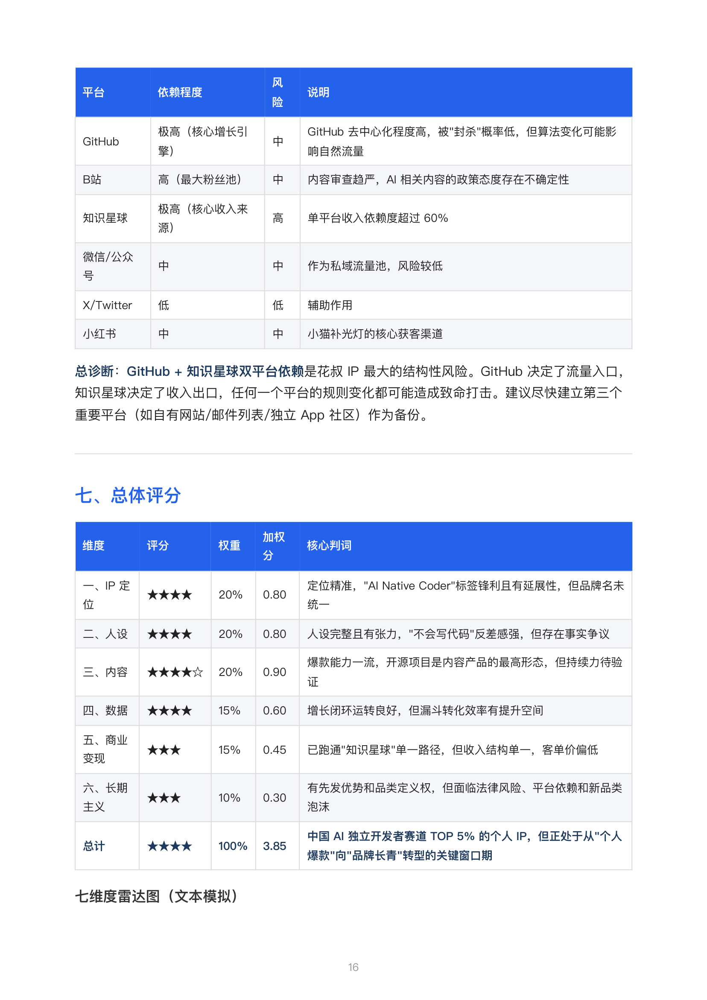
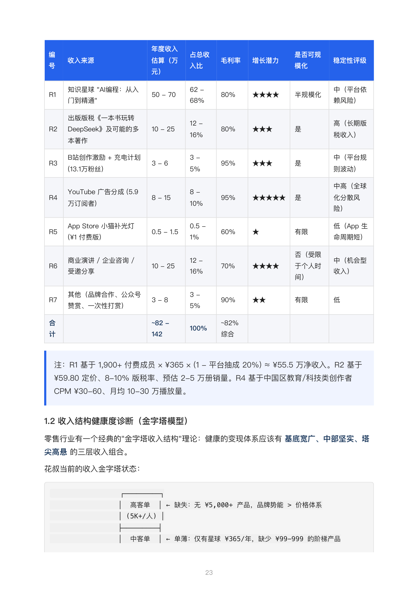
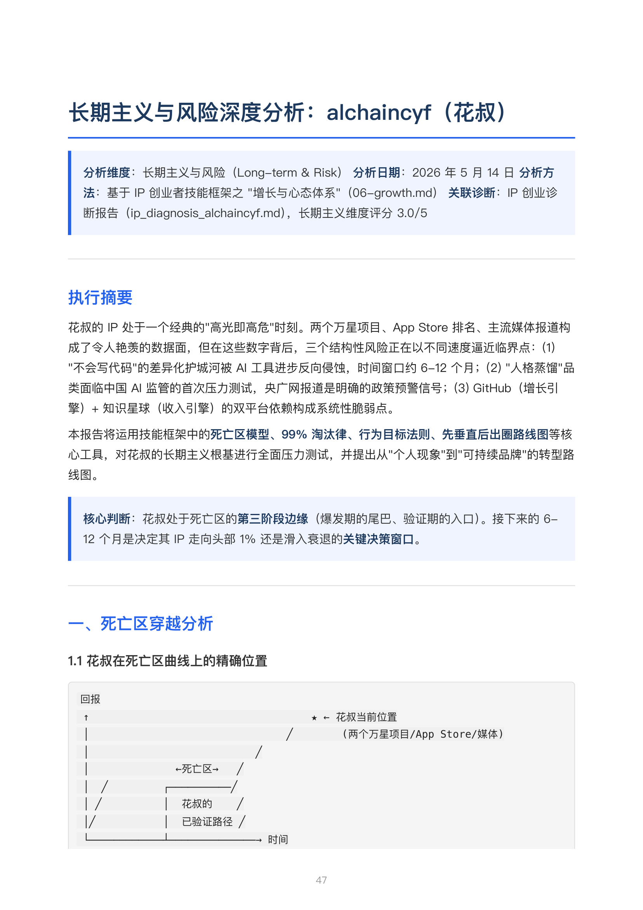
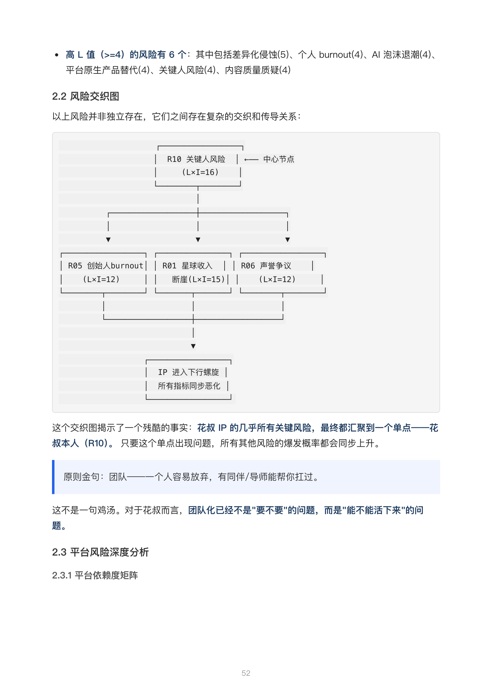
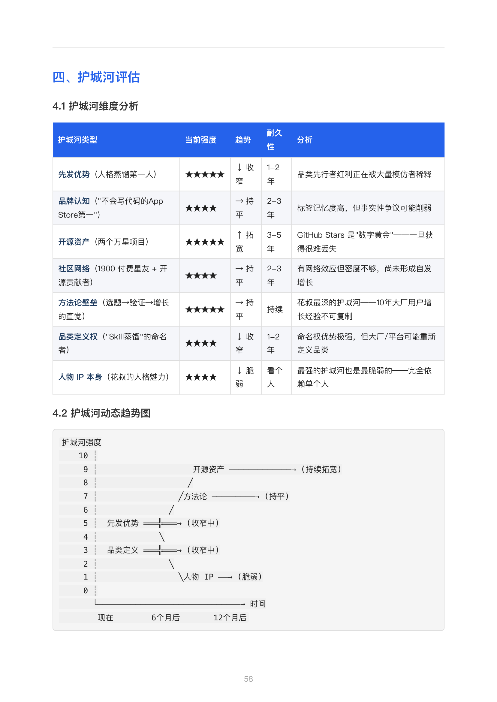
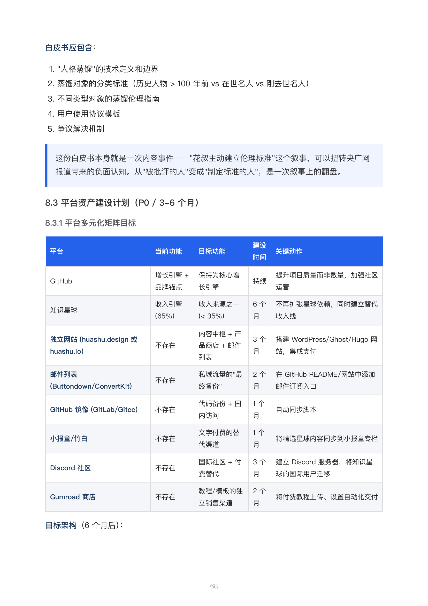

<div align="center">

# ip-entrepreneur-skills

**Claude Code / Codex Skill。一句「帮我诊断这个账号」，自动生成六维度 IP 创业诊断报告 —— 定位×人设×内容×数据×变现×长期，精读版 + 全面版双输出。**

[](https://github.com/JuneYaooo/ip-entrepreneur-skills/stargazers)
[](./LICENSE)
[](https://www.anthropic.com/claude-code)

🌐 **English** → [docs/README.en.md](./docs/README.en.md)

</div>

---

## 🎬 效果演示：输入一个账号，输出完整诊断报告

输入一句话描述（或一份链接/账号名），AI 自动爬取公开数据，按六维度框架生成一份 100+ 页的深度诊断报告。

<table>
<tr>
<th width="33%">输入：最小信息</th>
<th width="33%">输出：精华版（2-3 页）</th>
<th width="33%">输出：全面版（100+ 页）</th>
</tr>
<tr>
<td align="center"><sub>只需一句话，甚至一个账号名即可启动 — "帮我诊断王老六的账号"、"我是做 AI 编程教育赛道，帮我对标 5 个同赛道账号"</sub></td>
<td></td>
<td></td>
</tr>
</table>

---

## ✨ 能做什么

- 📊 **六维度深度诊断** — 定位 × 人设 × 内容 × 数据 × 变现 × 长期，覆盖 IP 创业全链路
- 🔍 **赛道竞品全览** — 自动对焦 5-8 个同赛道玩家，拆解人设、内容、变现、直播策略
- 📈 **数据驱动决策** — 收入公式拆解、转化漏斗诊断、增长阶段定位，用数据替代直觉
- 💰 **变现路径规划** — 定价策略、产品矩阵、营收模型，从粉丝量到收入的完整转化路径
- 🗺️ **死亡区分析** — 定位你在 IP 生命周期中的位置，识别核心风险并给出穿越策略
- ⚡ **双模输出** — 精华版（5 分钟读完+行动清单）+ 全面版（完整六维度分析），同时生成

---

## 📊 报告总览

### 精华版报告（读完 ≤5 分钟）

| 节 | 内容 |
|---|---|
| 赛道竞品全览 | 5-8 个同赛道账号 + 竞品对比表 + 差异化空白 |
| 变现方式拆解 | 常见变现路径 + 真实案例 + 门槛/天花板标注 |
| 定位建议 | 2-3 个可切入的差异化角度 + 一句话人设标签 |
| 内容模板 | 爆款选题 + 钩子公式 + 内容结构模式 |
| 行动清单 | 本周可执行的 5-10 件事 |

### 全面版报告（六维度框架）

<table>
<tr>
<th width="50%">维度</th>
<th width="50%">核心看点</th>
</tr>
<tr>
<td><b>1. IP 定位</b></td>
<td>三圈模型分析、差异化定位、账号八维自检</td>
</tr>
<tr>
<td><b>2. 人设诊断</b></td>
<td>背景/观点/经历/性格四层拆解、稀缺性评估</td>
</tr>
<tr>
<td><b>3. 内容诊断</b></td>
<td>人设×干货评估、爆款规律、选题健康度</td>
</tr>
<tr>
<td><b>4. 数据诊断</b></td>
<td>关键指标、转化漏斗、增长阶段定位</td>
</tr>
<tr>
<td><b>5. 商业变现</b></td>
<td>变现类型、定价策略、收入公式优化</td>
</tr>
<tr>
<td><b>6. 长期主义</b></td>
<td>死亡区位置、风险矩阵、跨平台架构</td>
</tr>
</table>

---

## 🖼 报告截图

### 综合评分雷达图 + 六维度得分

<div align="center">
  
</div>

### 死亡区曲线 — 你在 IP 生命周期的哪个阶段？

<div align="center">
  
</div>

### 风险矩阵 — 识别你的核心风险

<div align="center">
  
</div>

### 护城河趋势 — 哪些资产在增强，哪些在削弱？

<div align="center">
  
</div>

### 平台架构 — 理想的多平台流量分发网络

<div align="center">
  
</div>

---

## 🚀 安装

### 方式一：让 AI 自己装（推荐）

把下面这段 prompt 丢给你的 AI 助手（Claude Code / Codex / Cursor 都行），它会自动 clone 仓库并完成安装：

```
帮我安装 ip-entrepreneur-skills：
https://github.com/JuneYaooo/ip-entrepreneur-skills
```

### 方式二：手动安装

```bash
git clone git@github.com:JuneYaooo/ip-entrepreneur-skills.git
# Claude Code 会在当前目录的 .claude/skills/ 下自动识别 skill
# 或者放到 ~/.claude/skills/ip-entrepreneur/
```

---

## 🛠 怎么用

安装后，直接在 Claude Code 里说人话就行。

### 模式 A — 诊断现有账号

> 帮我诊断一下这个抖音账号：[账号名]，从定位、人设、内容、数据、变现、长期六个维度分析。

### 模式 B — 从 0 到 1 起步

> 我想在 [赛道] 做个人 IP，帮我做定位分析、人设设计和前 30 条选题规划。

### 模式 C — 增长突破

> 我账号目前 [现状]，数据卡在 [瓶颈]，帮我诊断问题并给出优化方案。

**核心方法论**内置于 SKILL.md 中，包含六维度框架、金句话术、实战 checklist 等完整知识体系。`references/` 目录下另有 6 份深度参考资料，agent 在诊断时会按需查阅。

---

## 📁 文件结构

```
ip-entrepreneur-skills/
├── SKILL.md                    # 核心 skill 入口（含 YAML frontmatter）
├── AGENTS.md                   # 给 codex / aider / cursor 等 agent 的索引入口
├── README.md                   # 项目说明
├── docs/
│   ├── README.en.md            # 英文 README
│   └── assets/                 # 演示截图
│       ├── report-page-16.png  # 六维度雷达图
│       ├── report-page-23.png  # 收入结构金字塔
│       ├── report-page-47.png  # 死亡区曲线
│       ├── report-page-52.png  # 风险矩阵
│       ├── report-page-58.png  # 护城河趋势
│       └── report-page-68.png  # 平台架构图
└── references/                 # 六维度深度方法论
    ├── 01-positioning.md       # IP 定位体系
    ├── 02-content.md           # 爆款内容体系
    ├── 03-data.md              # 数据驱动体系
    ├── 04-livestream.md        # 直播运营体系
    ├── 05-monetization.md      # 商业变现体系
    └── 06-growth.md            # 增长与心态体系
```

---

## ⭐ Star History

[](https://star-history.com/#JuneYaooo/ip-entrepreneur-skills&Date)

---

## License

Apache License 2.0
